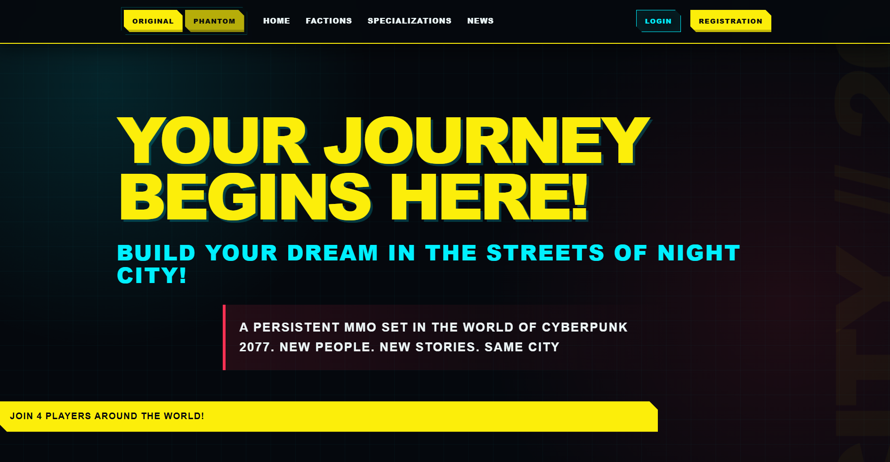

# Cyberpunk MMO

Cyberpunk MMO is a Django web application inspired by the world of Cyberpunk 2077. Users can create an account, manage a personal profile, build characters, explore factions and specializations, and switch between visual themes.
Link to the deployed website - https://cyberpunk-mmo.onrender.com/



## Features

- User registration, authentication, profile editing, and account deletion
- Character creation, editing, deletion, and search
- Character ownership and per-user character names
- Factions, specializations, skills, and news posts
- Dynamic character avatars based on sex, specialization, and faction
- Original and Phantom Liberty visual themes
- Responsive interface
- Automated tests for models, forms, views, profiles, and themes

## Prerequisites

Before starting, install the following software:

- [Python](https://www.python.org/downloads/) 3.12 or newer
- [Git](https://git-scm.com/downloads)

Confirm that both tools are available:

```bash
python --version
git --version
```

On some macOS and Linux systems, use `python3` instead of `python` in the commands below.

## Local installation

### 1. Clone the repository

```bash
git clone https://github.com/Avalanche-one/cyberpunk-mmo.git
cd cyberpunk-mmo
```

### 2. Create a virtual environment

Keeping dependencies in a virtual environment prevents conflicts with other Python projects.

Windows PowerShell:

```powershell
python -m venv .venv
.\.venv\Scripts\Activate.ps1
```

Windows Command Prompt:

```bat
python -m venv .venv
.venv\Scripts\activate.bat
```

macOS or Linux:

```bash
python3 -m venv .venv
source .venv/bin/activate
```

After activation, the terminal prompt should contain `(.venv)`.

### 3. Upgrade pip and install dependencies

```bash
python -m pip install --upgrade pip
python -m pip install -r requirements.txt
```

### 4. Configure local environment variables

The application uses `core.settings.dev` and SQLite during local development. Create a `.env` file in the project root.

Windows PowerShell:

```powershell
Copy-Item .env.sample .env
```

macOS or Linux:

```bash
cp .env.sample .env
```

For local development, replace the contents of `.env` with:

```dotenv
DJANGO_SETTINGS_MODULE=core.settings.dev
DJANGO_SECRET_KEY=django-insecure-local-development-only
```

The development secret must never be reused in production. The `.env` file is excluded from Git and must not be committed.

### 5. Apply database migrations

```bash
python manage.py migrate
```

This creates the local `db.sqlite3` database and all required tables.

### 6. Load the demo data

```bash
python manage.py loaddata dump_utf8.json
```

This loads the test users, factions, specializations, skills, characters, and other data used by the demo site. Run this command only once for a newly created database. Loading the same fixture repeatedly may cause conflicts with existing records.

### 7. Create an administrator account

This step is optional but recommended if you want to manage data through Django Admin.

```bash
python manage.py createsuperuser
```

Follow the prompts to create the account. The admin interface will be available at `/admin/`.

Also you can login as a common test user using: 
username - "test"
password - "cash312"

### 8. Run the development server

```bash
python manage.py runserver
```

Open the following address in a browser:

```text
http://127.0.0.1:8000/
```

Stop the server with `Ctrl+C`.

## Running tests

Run the complete automated test suite before submitting changes:

```bash
python manage.py test
```

Check the Django configuration:

```bash
python manage.py check
```

Verify that model changes have corresponding migrations:

```bash
python manage.py makemigrations --check --dry-run
```

All three commands should complete successfully.

## Common development commands

Create migrations after changing a model:

```bash
python manage.py makemigrations
python manage.py migrate
```

Collect static files using the production configuration:

```bash
python manage.py collectstatic --no-input --settings=core.settings.prod
```

Open the Django shell:

```bash
python manage.py shell
```

## Project structure

```text
cyberpunk_mmo/
|-- core/                    # Project configuration and environment settings
|   `-- settings/
|       |-- base.py          # Shared settings
|       |-- dev.py           # Local SQLite settings
|       `-- prod.py          # PostgreSQL production settings
|-- cyberpunk_mmo/           # Main Django application
|   |-- migrations/          # Database schema migrations
|   `-- tests/               # Automated tests
|-- static/                  # Source CSS and image assets
|-- templates/               # Django HTML templates
|-- build.sh                 # Production build script
|-- manage.py                # Django management entry point
`-- requirements.txt         # Pinned Python dependencies
```

## Production notes

Production uses `core.settings.prod` and requires the following environment variables:

```dotenv
DJANGO_SETTINGS_MODULE=core.settings.prod
DJANGO_SECRET_KEY=<long-random-secret>
RENDER_EXTERNAL_HOSTNAME=<application-hostname>
POSTGRES_DB=<database-name>
POSTGRES_DB_PORT=5432
POSTGRES_USER=<database-user>
POSTGRES_PASSWORD=<database-password>
POSTGRES_HOST=<database-host>
```

Generate a secure production key with:

```bash
python -c "from django.core.management.utils import get_random_secret_key; print(get_random_secret_key())"
```

Never commit production credentials or a populated `.env` file. Use the hosting provider's secret and environment-variable management instead.

The production build command is:

```bash
./build.sh
```

The production start command is:

```bash
gunicorn core.wsgi:application
```
